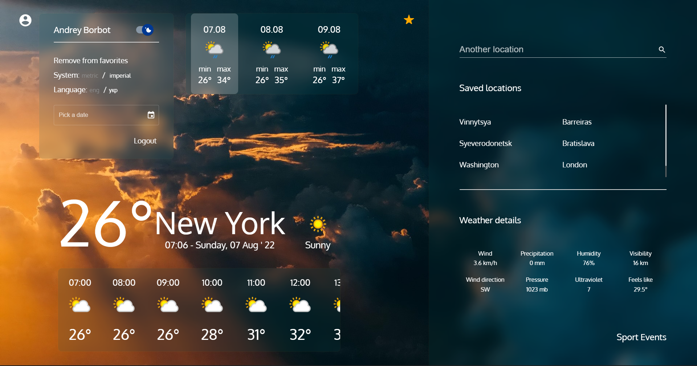

<!-- PROJECT LOGO -->
<br />
<p align="center">
  <a href="https://github.com/Broman3113/the-weather">
    
  </a>

<h3 align="center">theWeather</h3>

  <p align="center">
    Explanation in using the project.
    <br />
    <a href="https://github.com/Broman3113/the-weather"><strong>Explore the docs »</strong></a>
    <br />
    <br />
  </p>


<!-- TABLE OF CONTENTS -->
<details open="open">
  <summary>Table of Contents</summary>
  <ol>
    <li>
      <a href="#about-the-project">About The Project</a>
      <ul>
        <li><a href="#built-with">Built With</a></li>
      </ul>
    </li>
    <li>
      <a href="#getting-started">Getting Started</a>
      <ul>
        <li><a href="#installation">Installation</a></li>
      </ul>
    </li>
    <li><a href="#contact">Contact</a></li>
  </ol>
</details>


<!-- ABOUT THE PROJECT -->


[Project on Netlify](https://weatheronreact.netlify.app)
## About The Project

A project written on React that uses the OpenWeatherMap API to get the current and history weather conditions for a city. Also includes a search feature API to find the weather for any city.
This project uses a lot of features from the React framework and more,

Such as:

* React
* React Router
* React MaterialUI
* Thunk, Redux, Hooks, Context, and more 

### Built With

This project was written with the following plugins:

* [dayjs](https://day.js.org/)
* [react i18next](https://react.i18next.com/)
* [sass](https://sass-lang.com/)
* [swiper](https://swiperjs.com/react)
* [uuid](https://www.npmjs.com/package/uuid)
* And more

<!-- GETTING STARTED -->

## Getting Started

To get a local copy up and running follow these simple example steps.

### Installation

1. Clone the repo
   ```sh
   git clone https://github.com/Broman3113/the-weather.git
   ```
2. Install NPM packages
   ```sh
   npm install
   ```
3. To build dev project and run it
   ```sh
   npm start
   ```

## Contact

[Andrey Borbot](https://github.com/Broman3113)

Project Link: [https://github.com/Broman3113/the-weather](https://github.com/Broman3113/the-weather)
